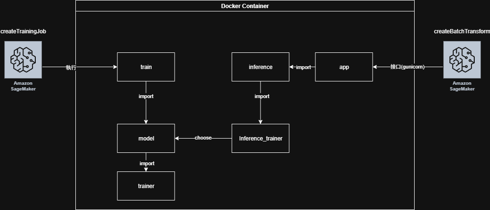
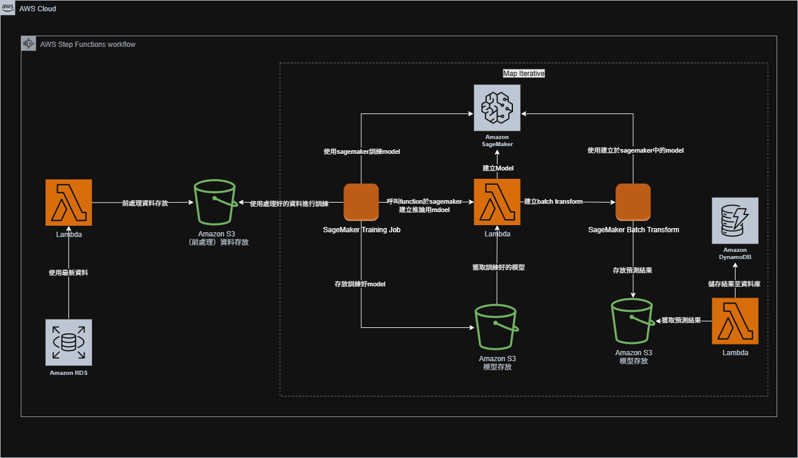

# End-to-End MLOps Project: Customer Purchase Prediction on SageMaker

## ✨ Project Overview

This project demonstrates a complete, end-to-end MLOps pipeline for predicting customer purchasing behavior, specifically forecasting the number of days until a customer's next purchase. The entire workflow, from data processing to model deployment, is built to run on **Amazon SageMaker**.

Here’s a breakdown of its key components and functionality:

1.  **Core Goal**: To predict the `OrderGapDays` (the time between a customer's orders) based on their transaction history.

2.  **Data Processing**:
    *   It uses the `Online_Retail.csv` dataset, which contains historical sales data.
    *   The `trainer.py` script processes this raw data by calculating key features for each customer, such as their average time between purchases (`RollingAvgGap`), cumulative spending (`CumulativeTotalPrice`), and total order count. It also engineers time-based features (like month, day of the week) to capture seasonal patterns.
    *   It includes a step to filter out outlier customers using an Isolation Forest algorithm to improve model accuracy.

3.  **Modeling**:
    *   The project is flexible and supports two different machine learning models, which can be chosen via a parameter:
        *   **XGBoost**: A powerful and efficient gradient boosting model.
        *   **PyTorch LSTM**: A Long Short-Term Memory neural network, which is well-suited for time-series forecasting.
    *   The `model.py` script contains the logic for training both types of models.

4.  **Training and Inference**:
    *   The entire application is packaged into a **Docker container**, which can be run in two modes as defined by `entrypoint.sh`:
        *   **`train` mode**: Executes the `train.py` script to train the chosen model on the processed data and saves the resulting model artifact (`model_artifact.pkl`).
        *   **`inference` mode**: Launches a **Flask web server** using Gunicorn. This server loads the trained model and exposes an API endpoint (`/invocations`) to make predictions on new data.

5.  **Automation (CI/CD)**:
    *   The `.github/workflows/main.yml` file defines a GitLab CI/CD pipeline that automates the process of building the Docker image and pushing it to **Amazon ECR** (Elastic Container Registry), making it ready for deployment on SageMaker.

In short, this is a complete, end-to-end SageMaker project that takes raw sales data, engineers predictive features, trains a model, and serves it via a web API to forecast when a customer will make their next purchase.

## 🚀 Key Features

*   **End-to-End Automation**: The entire workflow, from data extraction to prediction storage, is fully automated using AWS Step Functions.
*   **Modular & Swappable Architecture**: The codebase is decoupled, allowing for easy swapping of model frameworks (e.g., XGBoost, PyTorch LSTM, or even Transformers) without affecting the core pipeline.
*   **Containerized Environment**: A `Dockerfile` ensures a consistent and reproducible environment for both training and inference, whether running locally or on SageMaker.
*   **Cloud-Native Design**: Built specifically for the AWS ecosystem, leveraging SageMaker for training and deployment, S3 for data and artifact storage, and Lambda for serverless processing.
*   **Unified Codebase**: A single, shared codebase supports local testing, batch predictions, and online API serving, streamlining development and maintenance.

## 🔨 System Architecture

**Note on the Dataset and Architecture:** This project uses the static UCI Online Retail dataset to demonstrate a dynamic, production-grade MLOps architecture. In a real-world application, the data would originate from a live transactional database (like AWS RDS). The architecture presented here, orchestrated by AWS Step Functions, is designed to handle such a continuous data flow, making it a robust blueprint for a real-time customer prediction system. The UCI dataset serves as a realistic stand-in to validate the feasibility and automation of the end-to-end pipeline.

The project is designed with two distinct architectural layers: the application-level architecture within the Docker container, and the cloud-level MLOps workflow on AWS.

### 1. Code & Docker Architecture

The Docker container is designed for modularity and flexibility. It can operate in two modes (`train` or `inference`) determined at runtime.

*   **Training Mode**:
    1.  The `entrypoint.sh` script initiates the `train.py` module.
    2.  `train.py` uses the `DataTrainer` class to handle data loading and feature engineering.
    3.  A `trainer_factory` dynamically selects the specified model trainer (e.g., `XGBTrainer`).
    4.  The model is trained, and the final artifact (`model_artifact.pkl`) is saved to the `/opt/ml/model` directory, as expected by SageMaker.

*   **Inference Mode**:
    1.  The `entrypoint.sh` script launches a Gunicorn web server.
    2.  Gunicorn runs the Flask application defined in `app.py`.
    3.  The Flask app loads the trained model from `/opt/ml/model` via the `inference.py` module and exposes a prediction endpoint at `/invocations`.

This decoupled design ensures that changes to the model or data processing logic are isolated and do not interfere with the API serving mechanism.




### 2. MLOps Workflow on AWS

The entire machine learning lifecycle is automated and orchestrated by **AWS Step Functions**.



1.  **Data Extraction & Preprocessing**: A Lambda function is triggered to extract raw data from a source database (e.g., RDS). It performs initial preprocessing and uploads the cleaned data to an S3 bucket.
2.  **Automated Model Training**: The Step Functions workflow initiates a **SageMaker Training Job**. The job uses the containerized application to pull the training data from S3, train the model, and save the resulting model artifact back to S3.
3.  **Automated Batch Prediction**:
    *   Upon successful training, a Lambda function is triggered to create a **SageMaker Model** from the saved artifact.
    *   It then automatically starts a **SageMaker Batch Transform** job, which uses the model to generate predictions on a new dataset and saves the results to S3.
4.  **Serving Predictions**: A final Lambda function processes the prediction results from S3 and writes them to a **DynamoDB** table, making them available for downstream applications or user-facing dashboards.

This event-driven architecture ensures the entire process is automated, scalable, and includes built-in error handling and retry mechanisms via Step Functions.

## ➡️  How to Run Locally

This project can be run locally using Docker, simulating the SageMaker environment.

**Prerequisites:**
*   Docker installed.
*   AWS CLI installed and configured with your credentials.

**1. Build the Docker Image:**
```bash
docker build -t sagemaker-training .
```

**2. Run the Training Job:**
This command mounts the current directory into the container and runs the training script. The model artifact will be saved to the `SageMaker_Training/` directory.
```bash
docker run -v $(pwd):/opt/ml/code sagemaker-training train --file_path Online_Retail.csv
```

**3. Run the Inference Server:**
This command starts the Flask API server, which loads the trained model and exposes it on port 8080.
```bash
docker run -p 8080:8080 -v $(pwd):/opt/ml/code sagemaker-training inference
```

**4. Test the Endpoint:**
You can send a POST request with sample data to the `/invocations` endpoint to get a prediction.

## 📍 Future Improvements

*   **Experiment Tracking**: Integrate **MLflow** or **Weights & Biases** to systematically log hyperparameters, metrics, and model artifacts for better experiment management and reproducibility.
*   **Automated Testing**: Enhance the CI/CD pipeline by adding a dedicated testing stage with `pytest` for unit tests and `ruff` for code linting.
*   **Data Validation**: Incorporate a data validation tool like **Great Expectations** or **Pandera** into the pipeline to ensure data quality and prevent data drift from degrading model performance.
