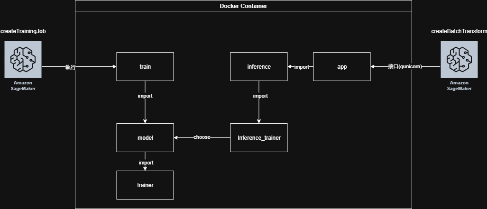

# End-to-End MLOps Project: Customer Purchase Prediction on SageMaker
[English](./README.md) | [中文](./README.zh-TW.md)
## ✨ 專案總覽

本專案旨在展示一個完整的端到端 MLOps 工作流程，核心目標是預測顧客的下一次購買行為（即預測距離下次購買的天數）。整個系統從資料處理到模型部署，都建構在 **Amazon SageMaker** 之上，並整合了多項 AWS 服務，以實現穩健且可擴展的自動化流程。

## 🚀 核心功能與 MLOps 實踐

*   **端到端自動化流程**: 使用 **AWS Step Functions** 來串連整個 ML 生命週期，從資料前處理到批次推論，實現完全自動化。
*   **模組化與可擴展的程式碼架構**: 專案的程式碼（如資料處理、模型訓練、API 服務）被拆分成獨立的模組。這種設計不僅讓程式碼更容易維護，也讓未來替換模型（例如從 XGBoost 更換為 Transformer）變得非常簡單，而無需改動整個系統流程。
*   **容器化環境**: 透過 **Docker** 將訓練、推論所需的環境與程式碼打包，確保在任何地方（本機或雲端）都能有一致的執行結果。
*   **雲原生設計**: 整個專案圍繞著 AWS 生態系打造，充分利用 SageMaker、S3、Lambda 等服務，展現了雲端解決方案的設計能力。
*   **CI/CD 整合**: 內建 **GitHub Actions** 工作流程，當程式碼被推送到 `main` 或 `dev` 分支時，會自動建構 Docker image 並將其推送到 **Amazon ECR**，為 SageMaker 部署做好準備。
*   **統一的程式碼庫**: 一套程式碼庫同時支援本地測試、批次預測與線上 API 服務，大幅簡化了開發與維護的複雜度。

## 🔨 系統架構

**關於資料集與架構的說明：** 本專案使用靜態的 UCI Online Retail 資料集來演示一個動態的、生產等級的 MLOps 架構。在真實世界的應用中，資料會來自一個即時的交易資料庫（如 AWS RDS）。這裡展示的架構由 AWS Step Functions 驅動，正是為了處理這種持續的資料流而設計，使其成為一個適用於即時顧客預測系統的穩健藍圖。UCI 資料集在此作為一個擬真的替代品，用以驗證整個端到端自動化流程的可行性。

專案的架構分為兩個層次：Docker 容器內的應用程式架構，以及在 AWS 上的雲端 MLOps 工作流程。

### 1. 程式碼與 Docker 架構

Docker 容器被設計為模組化且具備彈性，可根據執行時的參數切換 `train` 或 `inference` 模式。

*   **訓練模式**:
    1.  `entrypoint.sh` 腳本啟動 `train.py` 模組。
    2.  `train.py` 使用 `DataTrainer` 類別來載入資料並進行特徵工程。
    3.  `trainer_factory` 根據參數動態選擇指定的模型訓練器（例如 `XGBTrainer`）。
    4.  模型完成訓練後，最終的產物 (`model_artifact.pkl`) 會被儲存到 SageMaker 指定的 `/opt/ml/model` 目錄中。

*   **推論模式**:
    1.  `entrypoint.sh` 腳本啟動 Gunicorn 網頁伺服器。
    2.  Gunicorn 運行 `app.py` 中定義的 Flask 應用程式。
    3.  Flask 應用程式透過 `inference.py` 模組從 `/opt/ml/model` 載入訓練好的模型，並在 `/invocations` 提供預測服務的 API 端點。

這種解耦設計確保了模型或資料處理邏輯的變更被隔離開來，不會影響到 API 服務的穩定性。



### 2. AWS 上的 MLOps 工作流程

整個機器學習生命週期由 **AWS Step Functions** 自動化調度。


1.  **資料抽取與前處理**: Lambda 函式被觸發，從來源資料庫（如 RDS）抽取原始資料，進行初步處理後上傳至 S3。
2.  **自動化模型訓練**: Step Functions 工作流程啟動一個 **SageMaker Training Job**。此任務使用我們的容器，從 S3 讀取訓練資料，訓練模型，並將訓練好的模型產物存回 S3。
3.  **自動化批次預測**:
    *   訓練成功後，Lambda 函式會從 S3 的模型產物建立一個 **SageMaker Model**。
    *   接著，它會自動啟動一個 **SageMaker Batch Transform** 任務，用這個模型對新的資料集進行預測，並將結果儲存到 S3。
4.  **提供預測結果**: 最後一個 Lambda 函式處理 S3 中的預測結果，並將其寫入 **DynamoDB** 資料庫，以供下游應用或儀表板使用。

這種事件驅動的架構確保了整個流程的自動化、可擴展性，並透過 Step Functions 內建了錯誤處理與重試機制。

## 🔧 CI/CD 設定與配置

為了啟用 GitHub Actions 的自動化 CI/CD 工作流程，你需要在你的 GitHub repository 中設定 Secrets 和 Variables。

1.  **前往你的 repository 設定頁面：** `Settings` > `Secrets and variables` > `Actions`。

2.  **新增 Repository Secrets：**
    這些資訊會被加密，應用於儲存敏感資料。點擊 `New repository secret` 並新增以下項目：
    *   `AWS_ACCESS_KEY_ID`: 你的 AWS access key ID。
    *   `AWS_SECRET_ACCESS_KEY`: 你的 AWS secret access key。
    *   `PRIVATE_ACCOUNT_ID`: 你的 AWS Account ID。

3.  **新增 Repository Variable：**
    這用於儲存非敏感的設定值。點擊 `Variables` 分頁，然後點擊 `New repository variable`，新增以下項目：
    *   `ECR_REPOSITORY_NAME`: 你希望在 ECR 上使用的 repository 名稱 (例如 `my-sagemaker-project`)。

設定完成後，位於 `.github/workflows/main.yml` 的 GitHub Actions 工作流程就能夠安全地與 AWS 進行身份驗證，並將 Docker image 推送到你指定的 ECR repository。

## ➡️ 如何在本機端運行

本專案可使用 Docker 在本機模擬 SageMaker 環境運行。

**先決條件:**
*   已安裝 Docker。
*   已安裝 AWS CLI 並設定好你的 AWS 憑證。

**1. 建構 Docker Image：**
```bash
docker build -t sagemaker-training .
```

**2. 執行訓練任務：**
此指令會將當前目錄掛載到容器中並執行訓練腳本。模型產物將被儲存於 `SageMaker_Training/` 目錄下。
```bash
docker run -v $(pwd):/opt/ml/code sagemaker-training train --file_path Online_Retail.csv
```

**3. 啟動推論伺服器：**
此指令會啟動 Flask API 伺服器，它會載入剛訓練好的模型，並在 port 8080 提供服務。
```bash
docker run -p 8080:8080 -v $(pwd):/opt/ml/code sagemaker-training inference
```

**4. 測試 API 端點：**
你可以發送一個帶有樣本資料的 POST 請求到 `/invocations` 端點來獲取預測結果。

## 📍 未來的改進方向

*   **實驗追蹤 (Experiment Tracking)**: 整合 **MLflow** 或 **Weights & Biases**，以系統化地記錄超參數、評估指標與模型產物，從而實現更好的實驗管理與可重現性。
*   **自動化測試 (Automated Testing)**: 在 CI/CD 流程中增加一個專門的測試階段，使用 `pytest` 進行單元測試，並用 `ruff` 進行程式碼風格檢查。
*   **資料驗證 (Data Validation)**: 導入如 **Great Expectations** 或 **Pandera** 等工具，在流程中加入資料驗證步驟，以確保資料品質，並防止資料漂移導致模型性能下降。
