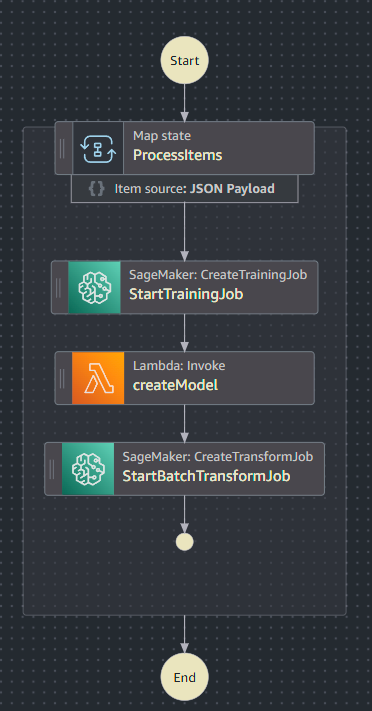

# AWS Example Configurations Tutorial

This directory contains example configurations for deploying various AWS services that integrate with the AutoMLOps project, specifically for orchestrating SageMaker training and batch transform jobs using AWS Step Functions and Lambda.

**Important:** These files are provided as templates and contain placeholder values that **must be replaced** with your actual AWS resource details before deployment.

## Files Overview

*   `aws_batch_transform.py`: An example AWS Lambda function that creates a SageMaker Batch Transform job.
*   `aws_create_model.py`: An example AWS Lambda function that creates a SageMaker Model from a trained artifact.
*   `aws_training_job.py`: An example AWS Lambda function that initiates a SageMaker Training Job.
*   `step_function.json`: An example AWS Step Functions State Machine definition that orchestrates the entire MLOps workflow (training, model creation, batch transform).

## How to Use These Examples

To use these example configurations, you will need to perform the following steps:

### 1. Replace Placeholders

Before deploying any of these resources, you **must** replace all placeholder values. Look for strings enclosed in angle brackets, such as:

*   `<YOUR_SAGEMAKER_EXECUTION_ROLE_ARN>`: Replace with the ARN of an IAM role that SageMaker can assume to access S3, ECR, and other necessary services.
*   `<YOUR_ECR_IMAGE_URI>`: Replace with the URI of your Docker image in Amazon ECR (e.g., `123456789012.dkr.ecr.ap-northeast-1.amazonaws.com/my-sagemaker-repo:latest`). This is the image built and pushed by your CI/CD pipeline.
*   `<YOUR_S3_BUCKET>`: Replace with the name of your S3 bucket where your data, model artifacts, and output will be stored.
*   `<YOUR_S3_MODEL_DATA_URL>`: The S3 URI where your trained model artifact (`model.tar.gz`) is located.
*   `<YOUR_S3_INPUT_URI>`: The S3 URI for your input data for batch transform jobs.
*   `<YOUR_S3_OUTPUT_URI>`: The S3 URI where the output of your training or batch transform jobs will be stored.
*   `<YOUR_S3_SAMPLE_PREFIX>`: An S3 prefix for sample prediction data.
*   `<YOUR_S3_MODEL_PREFIX>`: An S3 prefix for model artifacts.
*   `<YOUR_LAMBDA_FUNCTION_ARN>`: The ARN of the Lambda function that creates the SageMaker Model (used in `step_function.json`).

**Tip:** Ensure your IAM roles have the necessary permissions for SageMaker, S3, Lambda, and Step Functions to interact correctly.

### 2. Deploy AWS Resources

You can deploy these resources using the AWS Management Console, AWS CLI, or Infrastructure as Code (IaC) tools like AWS CloudFormation or Terraform.

#### Using AWS CLI (Manual Steps):

1.  **Create S3 Buckets:**
    ```bash
    aws s3 mb s3://your-sagemaker-data-bucket
    aws s3 mb s3://your-sagemaker-output-bucket
    # ... create other necessary buckets/prefixes
    ```

2.  **Create IAM Roles:** Create roles for SageMaker execution and Lambda execution with appropriate policies (e.g., `AmazonSageMakerFullAccess`, `AWSLambda_FullAccess`, S3 read/write permissions).

3.  **Deploy Lambda Functions:**
    *   Package your Lambda function code (e.g., `aws_batch_transform.py`, `aws_create_model.py`, `aws_training_job.py`) into a `.zip` file.
    *   Create the Lambda functions, specifying the runtime (Python 3.x), handler, and the IAM role created in the previous step.
    ```bash
    aws lambda create-function --function-name YourBatchTransformLambda --runtime python3.9 --zip-file fileb://your_batch_transform_lambda.zip --handler aws_batch_transform.lambda_handler --role arn:aws:iam::123456789012:role/YourLambdaExecutionRole
    # Repeat for aws_create_model.py and aws_training_job.py
    ```

4.  **Deploy Step Functions State Machine:**
    The `step_function.json` file defines the entire MLOps workflow, orchestrating the SageMaker training, model creation (via Lambda), and batch transform jobs. It uses a `Map` state to process multiple items in parallel.

    
    *   **Prepare `step_function.json`**: Before deployment, ensure all placeholders within `step_function.json` (e.g., `<YOUR_ECR_IMAGE_URI>`, `<YOUR_S3_BUCKET>`, `<YOUR_SAGEMAKER_EXECUTION_ROLE_ARN>`, `<YOUR_LAMBDA_FUNCTION_ARN>`) are replaced with your actual AWS resource ARNs and S3 paths.
    *   **Create the State Machine**:
    ```bash
    aws stepfunctions create-state-machine --name YourSageMakerWorkflow --definition file://step_function.json --role arn:aws:iam::123456789012:role/YourStepFunctionsExecutionRole
    ```
    *   **IAM Role for Step Functions**: The `--role` specified here is the IAM role that AWS Step Functions will assume to execute the state machine. This role needs permissions to invoke Lambda functions, start SageMaker training jobs, and create SageMaker batch transform jobs.

### 3. Trigger the Workflow

Once the Step Functions State Machine is deployed, you can initiate the workflow. The state machine is designed to accept an `itemList` as input, which its `Map` state will iterate over, triggering a full MLOps pipeline for each item.

You can trigger the workflow manually from the AWS Console or programmatically using the AWS SDK/CLI.

**Example Input for Triggering:**
```json
{
  "itemList": ["item1", "item2"]
}
```
Each string in the `itemList` array will be passed as `$.item` to the inner states of the `Map` (e.g., `training-job-item1-<timestamp>`, `s3://<YOUR_S3_BUCKET>/analysis_predict/item1/Online_Retail.csv`). This allows you to run the entire pipeline for different datasets or configurations by simply providing a list of identifiers.


This tutorial provides a basic guide. For a production environment, consider using AWS CloudFormation or AWS CDK for robust and repeatable deployments.
