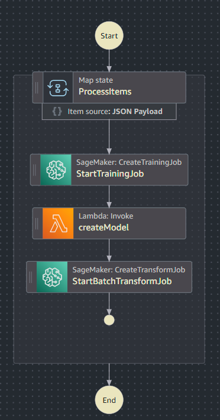

# AWS 範例配置教學

此目錄包含用於部署各種 AWS 服務的範例配置，這些服務與 AutoMLOps 專案整合，特別是使用 AWS Step Functions 和 Lambda 來協調 SageMaker 訓練和批次轉換任務。

**重要提示：** 這些檔案是作為範本提供的，包含佔位符值，在部署之前**必須替換**為您實際的 AWS 資源詳細資訊。

## 檔案概覽

*   `aws_batch_transform.py`: 建立 SageMaker 批次轉換任務的 AWS Lambda 函數範例。
*   `aws_create_model.py`: 從訓練好的模型產物建立 SageMaker 模型的 AWS Lambda 函數範例。
*   `aws_training_job.py`: 啟動 SageMaker 訓練任務的 AWS Lambda 函數範例。
*   `step_function.json`: 定義整個 MLOps 工作流程（訓練、模型建立、批次轉換）的 AWS Step Functions 狀態機範例定義。

## 如何使用這些範例

要使用這些範例配置，您需要執行以下步驟：

### 1. 替換佔位符

在部署任何這些資源之前，您**必須**替換所有佔位符值。尋找括在尖括號中的字串，例如：

*   `<YOUR_SAGEMAKER_EXECUTION_ROLE_ARN>`: 替換為 SageMaker 可以擔任以存取 S3、ECR 和其他必要服務的 IAM 角色 ARN。
*   `<YOUR_ECR_IMAGE_URI>`: 替換為您在 Amazon ECR 中的 Docker 映像 URI（例如，`123456789012.dkr.ecr.ap-northeast-1.amazonaws.com/my-sagemaker-repo:latest`）。這是由您的 CI/CD 管道建置和推送的映像。
*   `<YOUR_S3_BUCKET>`: 替換為您的 S3 儲存桶名稱，您的資料、模型產物和輸出將儲存在其中。
*   `<YOUR_S3_MODEL_DATA_URL>`: 您的訓練模型產物 (`model.tar.gz`) 所在的 S3 URI。
*   `<YOUR_S3_INPUT_URI>`: 用於批次轉換任務的輸入資料的 S3 URI。
*   `<YOUR_S3_OUTPUT_URI>`: 您的訓練或批次轉換任務輸出將儲存的 S3 URI。
*   `<YOUR_S3_SAMPLE_PREFIX>`: 範例預測資料的 S3 前綴。
*   `<YOUR_S3_MODEL_PREFIX>`: 模型產物的 S3 前綴。
*   `<YOUR_LAMBDA_FUNCTION_ARN>`: 建立 SageMaker 模型的 Lambda 函數 ARN（在 `step_function.json` 中使用）。

**提示：** 確保您的 IAM 角色具有 SageMaker、S3、Lambda 和 Step Functions 正確互動所需的權限。

### 2. 部署 AWS 資源

您可以使用 AWS 管理控制台、AWS CLI 或基礎設施即程式碼 (IaC) 工具（如 AWS CloudFormation 或 Terraform）部署這些資源。

#### 使用 AWS CLI（手動步驟）：

1.  **建立 S3 儲存桶：**
    ```bash
    aws s3 mb s3://your-sagemaker-data-bucket
    aws s3 mb s3://your-sagemaker-output-bucket
    # ... 建立其他必要的儲存桶/前綴
    ```

2.  **建立 IAM 角色：** 建立用於 SageMaker 執行和 Lambda 執行的角色，並具有適當的策略（例如，`AmazonSageMakerFullAccess`、`AWSLambda_FullAccess`、S3 讀/寫權限）。

3.  **部署 Lambda 函數：**
    *   將您的 Lambda 函數程式碼（例如，`aws_batch_transform.py`、`aws_create_model.py`、`aws_training_job.py`）打包成 `.zip` 檔案。
    *   建立 Lambda 函數，指定運行時（Python 3.x）、處理程序以及上一步中建立的 IAM 角色。
    ```bash
    aws lambda create-function --function-name YourBatchTransformLambda --runtime python3.9 --zip-file fileb://your_batch_transform_lambda.zip --handler aws_batch_transform.lambda_handler --role arn:aws:iam::123456789012:role/YourLambdaExecutionRole
    # 對 aws_create_model.py 和 aws_training_job.py 重複此操作
    ```

4.  **部署 Step Functions 狀態機：**
    
    `step_function.json` 檔案定義了整個 MLOps 工作流程，協調 SageMaker 訓練、模型建立（透過 Lambda）和批次轉換任務。它使用 `Map` 狀態來並行處理多個項目。

    *   **準備 `step_function.json`**：在部署之前，請確保 `step_function.json` 中的所有佔位符（例如，`<YOUR_ECR_IMAGE_URI>`、`<YOUR_S3_BUCKET>`、`<YOUR_SAGEMAKER_EXECUTION_ROLE_ARN>`、`<YOUR_LAMBDA_FUNCTION_ARN>`）都替換為您實際的 AWS 資源 ARN 和 S3 路徑。
    *   **建立狀態機**：
    ```bash
    aws stepfunctions create-state-machine --name YourSageMakerWorkflow --definition file://step_function.json --role arn:aws:iam::123456789012:role/YourStepFunctionsExecutionRole
    ```
    *   **Step Functions 的 IAM 角色**：此處指定的 `--role` 是 AWS Step Functions 將擔任以執行狀態機的 IAM 角色。此角色需要調用 Lambda 函數、啟動 SageMaker 訓練任務和建立 SageMaker 批次轉換任務的權限。

### 3. 觸發工作流程

部署 Step Functions 狀態機後，您可以啟動工作流程。狀態機旨在接受 `itemList` 作為輸入，其 `Map` 狀態將迭代處理，為每個項目觸發一個完整的 MLOps 管道。

您可以從 AWS 控制台手動觸發工作流程，或使用 AWS SDK/CLI 以程式方式觸發。

**觸發範例輸入：**
```json
{
  "itemList": ["item1", "item2"]
}
```
`itemList` 陣列中的每個字串都將作為 `$.item` 傳遞給 `Map` 的內部狀態（例如，`training-job-item1-<timestamp>`、`s3://<YOUR_S3_BUCKET>/analysis_predict/item1/Online_Retail.csv`）。這允許您透過簡單地提供一個標識符列表來為不同的資料集或配置運行整個管道。


本教學提供基本指南。對於生產環境，請考慮使用 AWS CloudFormation 或 AWS CDK 進行穩健且可重複的部署。
